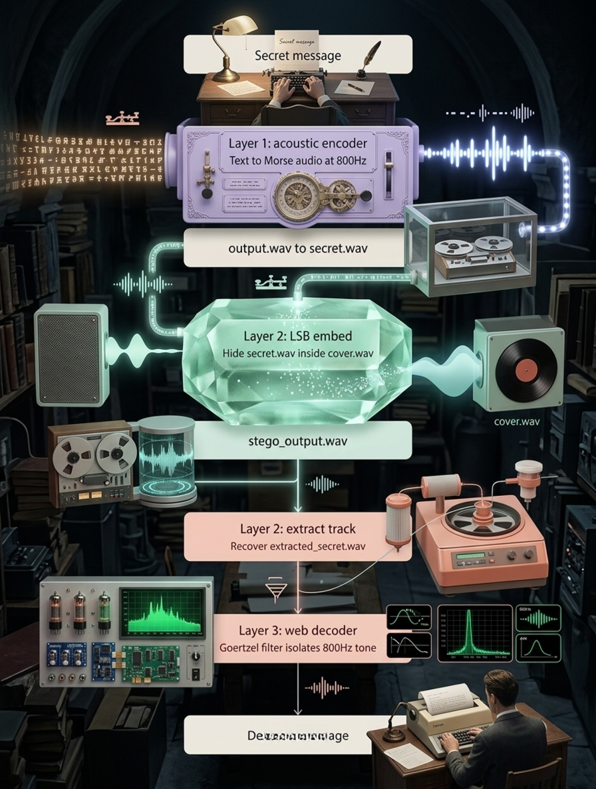

# 🕵️‍♂️ Project Shadow-Signal: Multi-Layer Audio Steganography


**Shadow-Signal** is a two-layer audio steganography suite built for educational and research purposes. It demonstrates how information can be concealed within audio data through two complementary techniques:

1. **Acoustic camouflage** — a secret message is converted into a Morse code audio track and hidden beneath procedurally generated ambient noise.
2. **LSB (Least Significant Bit) steganography** — that resulting audio file is embedded inside the bit structure of a normal, playable music track, leaving it audibly indistinguishable from the original.

A browser-based decoder then uses a Goertzel algorithm (a targeted DSP frequency filter) to extract and translate the hidden Morse signal back into readable text.

> 🎙️ **Live Web Decoder:** [Add your GitHub Pages link here]


*(Suggestion: add a banner image showing the Java terminal output alongside the web decoder UI)*

---

## 📑 Table of Contents

- [Overview](#overview)
- [Requirements](#requirements)
- [System Architecture & Execution Pipeline](#system-architecture--execution-pipeline)
  - [Phase 1: Acoustic Camouflage (Layer 1)](#phase-1-acoustic-camouflage-layer-1)
  - [Phase 2: LSB Steganography (Layer 2)](#phase-2-lsb-steganography-layer-2)
  - [Phase 3: Extraction & Decoding (Layer 3)](#phase-3-extraction--decoding-layer-3)
- [Directory Structure](#directory-structure)
- [Disclaimer](#disclaimer)
- [License](#license)

---

## Overview

Shadow-Signal walks a message through three stages: encoding it as an acoustic Morse signal, hiding that signal inside a cover song via LSB manipulation, and finally extracting and decoding it back into text using signal processing in the browser. Each phase can be run independently, making it useful as a learning tool for digital signal processing (DSP), audio file formats, and basic steganographic techniques.

## Requirements

- **Java Development Kit (JDK) 8 or later**
- A modern web browser (for the Layer 3 decoder)
- A `.wav` audio file to use as the "cover" track

---

## System Architecture & Execution Pipeline

### Phase 1: Acoustic Camouflage (Layer 1)

**Architecture:** A Java Swing desktop application converts an input text message into Morse code, rendered as an 800 Hz audio tone. This tone is layered beneath procedurally generated ambient noise and Gaussian hum to mask its presence.

**How to run:**

1. Navigate to the `Layer-1-Acoustic-Encoder/` directory.
2. Compile and launch the desktop UI:
   ```bash
   javac src/Main.java
   java -cp src Main
   ```
3. Enter your secret message in the application and click **Generate Audio**.
4. This produces `output.wav`.

---

### Phase 2: LSB Steganography (Layer 2)

**Architecture:** The Morse-encoded audio file from Phase 1 is treated as raw binary data. A Java command-line tool embeds these bytes into the least significant bit of each sample in a cover song, along with a 32-bit length header. The resulting amplitude change is at most 1/256th per sample — imperceptible to the human ear.

**How to run:**

1. Rename your generated `output.wav` to `secret.wav` and place it in `Layer-2-LSB-Stego/resources/`.
2. Place any normal, playable WAV file in the same folder and name it `cover.wav`.
3. Compile and run the sender:
   ```bash
   javac src/*.java
   java -cp src SenderMain
   ```
4. This produces `stego_output.wav` — a song that sounds identical to the original but carries the hidden payload.

---

### Phase 3: Extraction & Decoding (Layer 3)

**Architecture:** The recipient runs a Java extraction tool to recover the hidden Morse audio track from `stego_output.wav`. The extracted track is then loaded into a browser-based decoder, which applies a sliding Goertzel transform across 20 ms windows to act as a narrow bandpass filter. This isolates the 800 Hz Morse carrier from the ambient noise and converts the resulting timing pattern back into text.

**How to run:**

1. Place the received `stego_output.wav` in `Layer-2-LSB-Stego/resources/`.
2. Run the receiver to extract the hidden track:
   ```bash
   java -cp src ReceiverMain
   ```
   This saves the result as `extracted_secret.wav`.
3. Open `Layer-3-Web-Decoder/index.html` in your browser.
4. Drag and drop `extracted_secret.wav` into the dropzone to view the decoded message as the Goertzel filter isolates the signal.

---

## Directory Structure

```
Shadow-Signal/
│
├── Layer-1-Acoustic-Encoder/      # Java Swing UI (text -> Morse WAV)
│   └── src/
│       ├── audio/                 # Signal mixing & generation
│       ├── morse/                 # Text-to-Morse translation
│       ├── ui/                    # Desktop interface
│       └── Main.java
│
├── Layer-2-LSB-Stego/             # CLI tools (Morse WAV -> cover song)
│   ├── src/
│   │   ├── AudioEncoder.java
│   │   ├── AudioDecoder.java
│   │   ├── SenderMain.java
│   │   └── ReceiverMain.java
│   └── resources/
│       ├── cover.wav              # User-provided cover song
│       ├── secret.wav             # Hidden Morse track from Layer 1
│       ├── stego_output.wav       # Final encoded LSB output
│       └── extracted_secret.wav   # Decoded output from the receiver
│
└── Layer-3-Web-Decoder/           # Browser DSP UI (extracted WAV -> text)
    ├── index.html
    ├── style.css
    └── decoder.js
```

---

## Disclaimer

This project is intended for **educational purposes**, to demonstrate concepts in audio processing, signal analysis, and steganography. It is not designed or intended for use in evading lawful monitoring or for any illicit communication.

## License

This project is licensed under the [MIT License](LICENSE).
